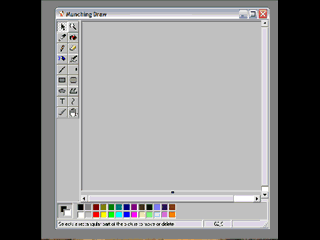



## vbPainter\-Transparent Layers\-Panorama

### Description

[Update: (03-30-08)Scanning support added using ezTwain {http://www.geocities.com/smigman.geo/mci/download.html} You may scan into a transparent layer. Some bugs removed and menus improved.]...This is modification of vbPaint by Theo Zacharias (theo_yz@yahoo.com). I've added transparent layers and the abilty to create panoramas. It has filters, the ability to edit the layers individually and to flatten or merge down. It's therefore a little like Photshop. The picture tells the story. Update(7-16-07): Bugs fixed. Update(07-10-07): I removed the un-needed references and components. I've also added the ability to cut &amp; paste from the Desktop with transparency. Update (07-19-07): I've added a help file (online as to not increase the file size) [http://www.moosenose.com/vbPainter/vbPainter.htm]. It can also be accessed through the help menu.
 
### More Info
 

             |
---                |---
**Submitted On**   |2008-03-30 14:54:42
**By**             |[Warren Goff](https://github.com/Planet-Source-Code/PSCIndex/blob/master/ByAuthor/warren-goff.md)
**Level**          |Advanced
**User Rating**    |4.8 (43 globes from 9 users)
**Compatibility**  |VB 6\.0
**Category**       |[Graphics](https://github.com/Planet-Source-Code/PSCIndex/blob/master/ByCategory/graphics__1-46.md)
**World**          |[Visual Basic](https://github.com/Planet-Source-Code/PSCIndex/blob/master/ByWorld/visual-basic.md)
**Archive File**   |[vbPainter\-2107903302008\.zip](https://github.com/Planet-Source-Code/warren-goff-vbpainter-transparent-layers-panorama__1-68963/archive/master.zip)

